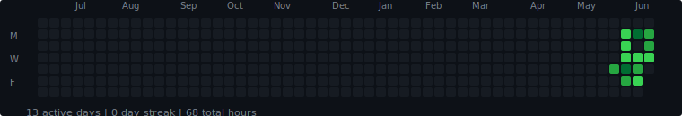

# GPU-Brrrometer

A containerized service that runs on your GPU rig to monitor GPU utilization (i.e. how much your GPU goes *brrr*) and generate a GitHub-style contribution graph.



## Setup

### Prerequisites

1. Install Docker and Docker Compose
2. Install NVIDIA drivers and NVIDIA Container Toolkit on the host, e.g. on Ubuntu:

   ```bash
   # Check if NVIDIA drivers are installed
   nvidia-smi

   # If not installed, install NVIDIA drivers first
   # Then install NVIDIA Container Toolkit
   distribution=$(. /etc/os-release;echo $ID$VERSION_ID)
   curl -fsSL https://nvidia.github.io/libnvidia-container/gpgkey | sudo gpg --dearmor -o /usr/share/keyrings/nvidia-container-toolkit-keyring.gpg
   curl -s -L https://nvidia.github.io/libnvidia-container/$distribution/libnvidia-container.list | \
       sed 's#deb https://#deb [signed-by=/usr/share/keyrings/nvidia-container-toolkit-keyring.gpg] https://#g' | \
       sudo tee /etc/apt/sources.list.d/nvidia-container-toolkit.list

   sudo apt-get update
   sudo apt-get install -y nvidia-container-toolkit
   sudo nvidia-ctk runtime configure --runtime=docker
   sudo systemctl restart docker
   ```

3. Verify NVIDIA Container Toolkit installation, e.g. on Ubuntu:

   ```bash
   # Check if the package is installed
   dpkg -l | grep nvidia-container-toolkit

   # Check if NVIDIA runtime is configured in Docker
   docker info | grep -i nvidia

   # Test GPU access
   docker run --rm --gpus all nvidia/cuda:11.0-base nvidia-smi
   ```

### Building and Running

1. Build the containers:
   ```bash
   docker compose build
   ```

2. Start the services:
   ```bash
   docker compose up -d
   ```

3. View database contents:
   ```bash
   docker compose exec collector python3 gpu_activity_collector.py --show-db
   ```

4. Run a dry run (test without updating database):
   ```bash
   docker compose exec collector python3 gpu_activity_collector.py --dry-run
   ```

### API Server

The API server provides endpoints to generate GitHub-style contribution graphs:

- **SVG Graph**: `http://localhost:8080/gpu-activity.svg`
- **Health Check**: `http://localhost:8080/health`
- **API Info**: `http://localhost:8080/`

#### SVG Parameters

- `theme`: `light` or `dark` (default: `light`)
- `weeks`: Number of weeks to display (default: `53`)

Examples:
```bash
# Light theme, 53 weeks
curl http://localhost:8080/gpu-activity.svg

# Dark theme, 26 weeks
curl http://localhost:8080/gpu-activity.svg?theme=dark&weeks=26
```

### GitHub Actions: Automatic SVG Caching

This project includes a GitHub Actions workflow (`.github/workflows/update-svg.yml`) that automatically fetches the latest GPU activity SVG from your API server and commits it to the repository. This ensures your GitHub profile or README can always display the latest activity graph, even if your server is offline.

**How it works:**
- The workflow runs every 12 hours (and can also be triggered manually).
- It connects to your private network using Tailscale (via the Tailscale GitHub Action).
- It fetches the SVG from your API server (e.g., `http://scale-1:8081/gpu-activity.svg?theme=dark`).
- If the SVG has changed, it commits and pushes the update to the repository.

**Setup:**
1. Create a Tailscale OAuth client in your Tailscale admin console.
2. Add the OAuth client ID and secret as GitHub repository secrets named `TS_OAUTH_CLIENT_ID` and `TS_OAUTH_SECRET`.
3. Ensure your Tailscale ACLs allow the tag used by the workflow (e.g., `tag:gpu-brrrometer-github-actions`) to access your API server.
4. The workflow is defined in `.github/workflows/update-svg.yml` and requires no further configuration unless you want to change the fetch URL or schedule.

You can reference the local `gpu-activity.svg` in your README or GitHub profile for a reliable, always-available activity graph.


```markdown

```

### Data Persistence

The SQLite database is stored in `/var/lib/gpu-brrrometer/activity.db` on the host system and is mounted into both containers. This ensures that the data persists even if the containers are removed.

### Container Management

- View logs:
  ```bash
  docker compose logs -f
  ```

- View logs for specific service:
  ```bash
  docker compose logs -f gpu-brrrometer
  docker compose logs -f gpu-api
  ```

- Restart the services:
  ```bash
  docker compose restart
  ```

- Stop and remove the containers:
  ```bash
  docker compose down
  ```

- Check container status:
  ```bash
  docker compose ps
  ```

## How It Works

The GPU Activity Collector:

1. **Samples GPU utilization** every 5 seconds using NVIDIA Management Library (NVML)
2. **Aggregates data** every minute to calculate:
   - Active minutes (time above 1% utilization threshold)
   - Peak utilization percentage
   - Average utilization percentage
3. **Stores data** in a SQLite database with daily records
4. **Cleans up** old data automatically (removes entries older than 365 days)

The API Server:

1. **Reads activity data** from the shared SQLite database
2. **Generates SVG graphs** in GitHub contribution style
3. **Provides REST endpoints** for easy integration
4. **Supports themes** (light/dark) and customizable time ranges

## Database Schema

The SQLite database (`activity.db`) contains a single table `gpu_activity` with the following columns:

- `date`: The date of the activity (YYYY-MM-DD)
- `minutes`: Total minutes of GPU activity
- `peak_utilization`: Peak GPU utilization percentage
- `avg_utilization`: Average GPU utilization percentage
- `last_updated`: Timestamp of the last update

## Configuration

The collector uses the following default settings:

- **Sampling interval**: 5 seconds
- **Utilization threshold**: 1% (activity below this is considered idle)
- **Database location**: `/var/lib/gpu-brrrometer/activity.db`
- **Data retention**: 365 days

The API server uses:

- **Port**: 8080
- **Cache duration**: 30 minutes
- **Default theme**: light
- **Default weeks**: 53

These settings can be modified by editing the constants in the respective Python files. 
